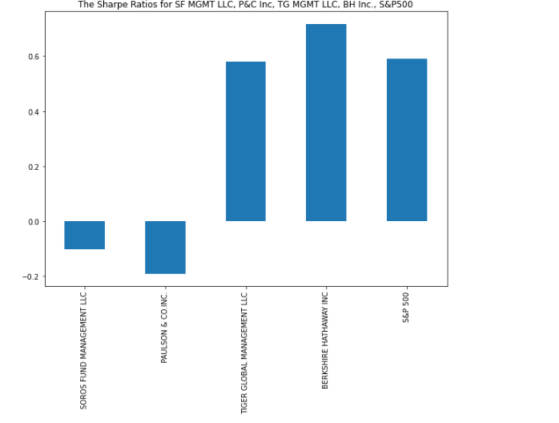
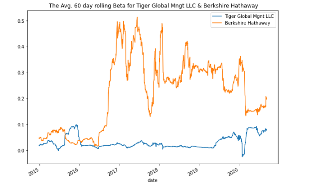

# Challenge_4_Portfolios_Quantitative_Analysis
This project is to evaluate four new investment (funds) options and to select the one with the best risk/return (highest returns with the lowest risk) metrics into a clients portfolio. The S&P 500 was selected as the benchmark Index to compare the four funds too.
The Jupyter Lab notebook has been used for the quantitative analysis (visualization and computation).

----

## Technologies
The programming language used for this analysis was **Python (v 3.9.7)**.

The applicable libraries needed to run this analysis are:
>

---
## Installation Guide

All of the above libraries should be part of the base applications that were installed with the Python version above; if not, you will have to install them through the pip package manager of Python.

---
## Contributor

James Handral
james.handral@gmail.com

---
## License

N/A

---

## Summary of Analysis

1) Closing prices from 10/1/2014 through 9/11/2020 for the four funds (Soros Fund Mgnt LLC, Paulson & Co. Inc., Tiger Global Mgnt LLC, & Berkshire Hathaway Inc.) and the S&P 500 Index were utilzied for the quantitative analysis. Below is a line graph of the cumulative returns computed for the 4 funds and the S&P 500 for the listed periods above. This was utilized to compare the 4 funds against the S&P 500 Index.

2) Per the Sharp ratio (return/risk ratio annualzied) computation shown below Tiger Global Mgnt LLC and Berkshire Hathaway Inc. were the 2 funds that were in line with the overall returns of the S&P 500 Index; So they were selected for further analysis for inclusion into the client's portfolio.

3) Per the average 60 day rolling Beta for Tiger Global Mngt LLC and Birshire Hathaway plot below Berkshire was more sensitvie to movement in the S&P 500 per its huge swings and Tiger Global was the least volatile compared to the S&P 500 Index.

In conclusion, I would recommend Tiger Global Management LLC for inclusion into the clients portfolio because the average beta movement of the portfolio was between 0 and .01 from 2015 through 2020 which shows extremly low volatily against the market and its postive Sharp Ratio.

**link to Analysis**

[risk_return_analysis](./Starter_Code(3)/Starter_Code/risk_return_analysis.ipynb)
